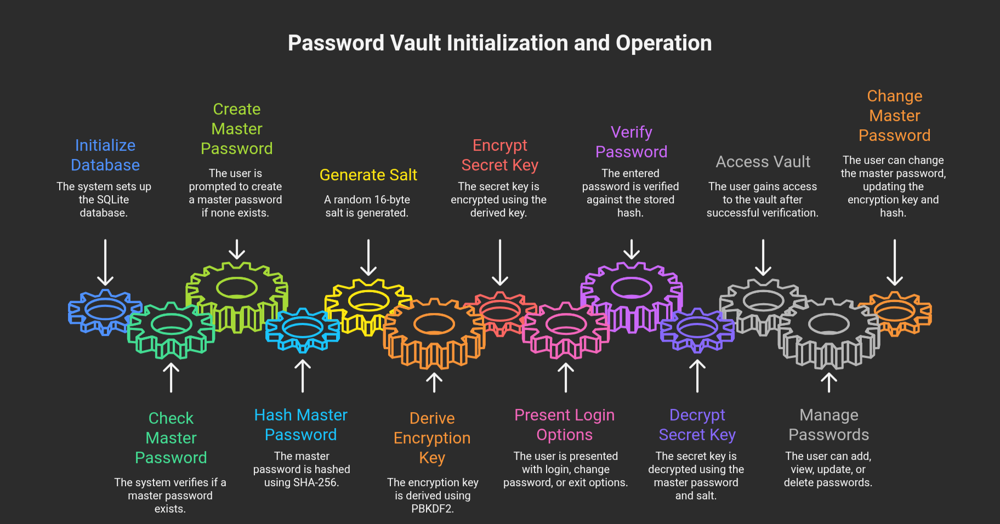

# Password Vault

A secure, local password manager built with Python, SQLite, and the `cryptography` library.  
It lets you safely store, encrypt, and manage your credentials entirely ***offline*** from your terminal.

---

## Features

- Master password protection
- AES-based encryption using `cryptography.fernet`
- Local SQLite3 database
- Add, view, and delete stored credentials
- CLI-based and lightweight
- Modular code structure for easy extension

---



## Tech Stack

- Python 3
- SQLite3
- cryptography (Fernet symmetric encryption)
- hashlib for password hashing

---

## Setup

```bash
git clone https://github.com/infernophoenix100/password-vault.git
cd password_vault
python3 -m venv venv
source venv/bin/activate
pip install -r requirements.txt
python3 main.py
```

---

## Usage

On first run, create a master password.
A `secret.key` file will be generated for encryption.
Your credentials are stored securely in `vault.db`.

Menu options:

```
1. Add new entry  
2. View specific entry  
3. Delete an entry  
4. View all passwords  
5. Update service name  
6. Update email  
7. Update password  
8. Exit

```

---

## Security Notes

- Passwords are encrypted at rest using AES (Fernet).
- The master password is hashed (SHA-256).
- Keep `secret.key` safe — without it, passwords cannot be decrypted.
- `.gitignore` prevents sensitive files from being uploaded.

---
